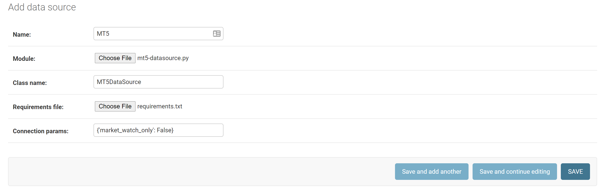

# algobuilder
A python application for building and running your algo-trading strategies. Algobuilder supports:
* Plugin datasources for collecting price data;
* Plugin feature calculations to build the features that your strategies algo-trading will use; and
* Plugin strategies to calculate trading recommendations from your calculated features.

# Setup
1) Set up your python environment.
2) Setup a empty database. This application has been tested on postgresql but should support all main databases.
3) Install the required libraries.

```shell
pip install -r algobuilder/requirements.txt
```

4) Configure the database connection by editing the default database in the DATABASES section contained in algobuilder\settings.py.

5) Build the applications' database.

```shell
python manage.py migrate
```

6) Create your admin superuser.
```shell
python manage.py createsuperuser
```

7) Launch the applications web server.
```shell
python manage.py runserver
```

Your application is ready for you to configure your datasource(s) for price data. Note: your application can support multiple data sources.

# Configure your DataSource
1) Create a python class to implement the connection to your price data source. Implement the methods to retrieve the symbol and price data from your datasource. An example that retrieves data from MetaTrader5 is provided below.

mt5-datasource.py
```python
import logging
import MetaTrader5

from pricedata.datasource import DataSourceImplementation


class MT5DataSource(DataSourceImplementation):
    """
    MetaTrader 5 DataSource
    """
    def __init__(self, data_source_model):
        # Super
        DataSourceImplementation.__init__(self, data_source_model=data_source_model)

        # Connect to MetaTrader5. Opens if not already open.

        # Logger
        self.__log = logging.getLogger(__name__)

        # Open MT5 and log error if it could not open
        if not MetaTrader5.initialize():
            self.__log.error("initialize() failed")
            MetaTrader5.shutdown()

        # Print connection status
        self.__log.debug(MetaTrader5.terminal_info())

        # Print data on MetaTrader 5 version
        self.__log.debug(MetaTrader5.version())

    def __del__(self):
        # shut down connection to the MetaTrader 5 terminal
        MetaTrader5.shutdown()

    def get_symbols(self):
        """
        Gets list of symbols from MT5
        :return: list of symbol names
        """

        all_symbols = MetaTrader5.symbols_get()

        # Are we returning MarketWatch symbols only
        market_watch_only = self._data_source_model.get_connection_param('market_watch_only')

        # We are only returning the symbol names
        symbol_names = []

        # Iterate all symbols, and populate symbol names, taking into account visible flag if we are returning market
        # watch symbols only.
        for symbol in all_symbols:
            if market_watch_only is False or (market_watch_only is True and symbol.visible):
                symbol_names.append(symbol.name)

        # Log symbol counts
        total_symbols = MetaTrader5.symbols_total()
        num_selected_symbols = len(symbol_names)
        self.__log.debug(f"{num_selected_symbols} of {total_symbols} returned. market_watch_only={market_watch_only}.")

        return symbol_names

```

2) Create a requirements.txt file containing all the modules required for your datasource. An example that supports the MetaTrader5 datasource is shown below.

requirments.txt
```text
MetaTrader5==5.0.34
```

3) Launch the applications web server if it isn't already running.
```shell
python manage.py runserver
```

4) In a web browser, navigate to the datasource admin page (http://localhost:8000/admin/pricedata/datasource/) and log in using the admin account that you created in setup.

5) Click 'ADD DATA SOURCE' to your data source :
   * Provide a name for your datasource; 
   * Select the python file and requirements file that you created in steps 1 & 2;
   * Enter the classname as defined in your module;
   * Provide any parameters required by your datasource class as a string representation of a dict. (e.g. the MetaTrader example above requires a market_watch_only parameter which can be input as {market_watch_only: False}); and
   * Click save.
   
A screenshot for our above example has been provided below.
     

    
Your datasource will now be configured. All symbols from your datasource will be available in this application.


