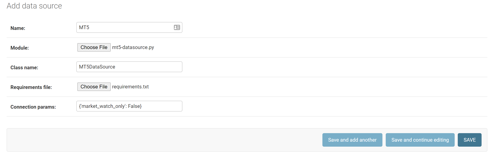

# Retrieving Price Data
To retrieve price data for AlgoBuilder, you will need to:
* Build your datasource; 
* Configure your datasource;
* Select the symbols to retrieve; and
* Define the periods for the price data candles to retrieve.

## Build your datasource
A datasource is the source of the symbol and price data for your application. AlgoBuilder can currently retrieve price data from  multiple datasets.

1) Create a python class to implement the connection to your price data source. This should extend ```pricedata.datasource.DataSourceImplementation```. Any parameters required for your data source will be provided during set up and can be accessed through ```self._data_source_model.get_connection_param('param_name')```. Your datasource must implement the following methods:
   * ```get_symbols(self) -> List[Dict[str, str]]:``` This should return a list of symbols for your datasource. Each symbol is a dict containing 'symbol_name' and 'instrument_type'. A list of supported instrument_types is available in ```models.instrument_types```.
   * ```get_prices(self, symbol: str, from_date: datetime, to_date: datetime, period: str) -> pd.DataFrame:``` This should return a dataframe of price data candles for the specified symbol name between the specified date range. The candles returned should be for the specified period. Supported period values are available in ```models.candle_periods```. For any period that you don't wish to support, you should raise a ```datasource.PeriodNotImplementedError```. 
   *  An example that retrieves symbol and price data from MetaTrader5 is provided below. This examples makes use of the MetaTrader copy_rates and copy_ticks APIs, using ticks and resampling for periods not supported by the rates API.

mt5-datasource.py
```python
import logging
import pandas as pd
from datetime import datetime
from typing import List, Dict

import MetaTrader5

from pricedata.datasource import DataSourceImplementation


class MT5DataSource(DataSourceImplementation):
    """
    MetaTrader 5 DataSource
    """
    def __init__(self, data_source_model):
        # Super
        DataSourceImplementation.__init__(self, data_source_model=data_source_model)

        # Connect to MetaTrader5. Opens if not already open.

        # Logger
        self.__log = logging.getLogger(__name__)

        # Open MT5 and log error if it could not open
        if not MetaTrader5.initialize():
            self.__log.error("initialize() failed")
            MetaTrader5.shutdown()

        # Print connection status
        self.__log.debug(MetaTrader5.terminal_info())

        # Print data on MetaTrader 5 version
        self.__log.debug(MetaTrader5.version())

    def __del__(self):
        # shut down connection to the MetaTrader 5 terminal
        MetaTrader5.shutdown()

    def get_symbols(self) -> List[Dict[str, str]]:
        """
        Get symbols from MetaTrader5

        :return: list of dictionaries containing symbol_name and instrument_type
        """

        all_symbols = MetaTrader5.symbols_get()

        # Are we returning MarketWatch symbols only
        market_watch_only = self._data_source_model.get_connection_param('market_watch_only')

        # We are returning the symbol names and instrument types
        symbols = []

        # Iterate all symbols, and populate symbol names, taking into account visible flag if we are returning market
        # watch symbols only.
        for symbol in all_symbols:
            if market_watch_only is False or (market_watch_only is True and symbol.visible):
                instrument_type = None
                if symbol.path.startswith('CFD'):
                    instrument_type = 'CFD'
                elif symbol.path.startswith('Forex'):
                    instrument_type = 'FOREX'

                symbols.append({'symbol_name': symbol.name, 'instrument_type': instrument_type})

        # Log symbol counts
        total_symbols = MetaTrader5.symbols_total()
        num_selected_symbols = len(symbols)
        self.__log.debug(f"{num_selected_symbols} of {total_symbols} returned. market_watch_only={market_watch_only}.")

        return symbols

    def get_prices(self, symbol: str, from_date: datetime, to_date: datetime, period: str) -> pd.DataFrame:
        """
        Gets OHLC price data for the specified symbol from MT5.
        :param symbol: The name of the symbol to get the price data for.
        :param from_date: Date from when to retrieve data
        :param to_date: Date to receive data up to
        :param period: The period for the candes. Possible values are defined in models.candle_periods:

        :return: Price data for symbol as pandas dataframe containing the following columns:
            ['time', 'period', 'bid_open', 'bid_high', 'bid_low', 'bid_close',
            'ask_open', 'ask_high', 'ask_low', 'ask_close', 'volume']
        """

        prices_dataframe = None

        # Mappings between defined periods and MT5 timeframes
        period_mapping = {
            '1S': None,
            '5S': None,
            '10S': None,
            '15S': None,
            '30S': None,
            '1M': MetaTrader5.TIMEFRAME_M1,
            '5M': MetaTrader5.TIMEFRAME_M5,
            '10M': MetaTrader5.TIMEFRAME_M10,
            '15M': MetaTrader5.TIMEFRAME_M15,
            '30M': MetaTrader5.TIMEFRAME_M30,
            '1H': MetaTrader5.TIMEFRAME_H1,
            '3H': MetaTrader5.TIMEFRAME_H3,
            '6H': MetaTrader5.TIMEFRAME_H6,
            '12H': MetaTrader5.TIMEFRAME_H12,
            '1D': MetaTrader5.TIMEFRAME_D1,
            '1W': MetaTrader5.TIMEFRAME_W1,
            '1MO': MetaTrader5.TIMEFRAME_MN1
        }

        # Get the MT5 timeframe from the supplied period
        timeframe = period_mapping[period]

        # If we have an equivalent timeframe in MT5, get candles, otherwise get ticks and resample
        if timeframe is not None:
            # Get prices from MT5
            prices = MetaTrader5.copy_rates_range(symbol, timeframe, from_date, to_date)
            if prices is None:
                error = MetaTrader5.last_error()
                self.__log.error(f"Error retrieving prices for {symbol}: {error}")
            else:
                self.__log.debug(f"{len(prices)} prices retrieved for {symbol}.")

                # Create dataframe from data and convert time in seconds to datetime format
                prices_dataframe = \
                    pd.DataFrame(columns=self._prices_columns,
                                 data={'time': prices['time'], 'period': period, 'bid_open': prices['open'],
                                       'bid_high': prices['high'], 'bid_low': prices['low'],
                                       'bid_close': prices['close'],
                                       'ask_open': prices['open'] + prices['spread'] / 10000,
                                       'ask_high': prices['high'] + prices['spread'] / 10000,
                                       'ask_low': prices['low'] + prices['spread'] / 10000,
                                       'ask_close': prices['close'] + prices['spread'] / 10000,
                                       'volume': prices['tick_volume']})

                prices_dataframe['time'] = pd.to_datetime(prices_dataframe['time'], unit='s')
        else:
            # Get ticks from MT5
            ticks = MetaTrader5.copy_ticks_range(symbol, from_date, to_date, MetaTrader5.COPY_TICKS_ALL)

            # If ticks is None, there was an error
            if ticks is None:
                error = MetaTrader5.last_error()
                self.__log.error(f"Error retrieving ticks for {symbol}: {error}")
            else:
                self.__log.debug(f"{len(ticks)} ticks retrieved for {symbol}.")

                try:
                    # Create dataframe from data and convert time in seconds to datetime format
                    ticks_dataframe = pd.DataFrame(ticks)
                    ticks_dataframe['time'] = pd.to_datetime(ticks_dataframe['time'], unit='s')

                    # Set the index, resample bid and ask columns, merge, then reset index
                    ticks_dataframe = ticks_dataframe.set_index('time')
                    ohlc_calcs = {'open': 'first', 'high': 'max', 'low': 'min', 'close': 'last', 'volume': 'count'}
                    bid_candles = ticks_dataframe['bid'].resample(period).agg(ohlc_calcs)
                    ask_candles = ticks_dataframe['ask'].resample(period).agg(ohlc_calcs)
                    prices_dataframe = pd.concat([bid_candles, ask_candles], axis=1)
                    prices_dataframe.reset_index(inplace=True)

                    # We should now have time and (open, high, low, close, volume) * 2, one for bid and one for ask.
                    # Add period, rename the columns, then delete the first volume column.
                    prices_dataframe.insert(1, 'period', period)
                    prices_dataframe.columns = ['time', 'period', 'bid_open', 'bid_high', 'bid_low', 'bid_close',
                                                'bid_volume', 'ask_open', 'ask_high', 'ask_low', 'ask_close', 'volume']
                    prices_dataframe.drop('bid_volume', axis=1, inplace=True)  # First volume column

                    # Remove n/a
                    prices_dataframe = prices_dataframe.dropna()

                except RecursionError as ex:
                    self.__log.warning("Error converting ticks to dataframe and resampling.", ex)

        # If the dataframe is None, create an empty one
        if prices_dataframe is None:
            prices_dataframe = pd.DataFrame(columns=self._prices_columns)

        # Make time timezone aware. Times returned from MT5 are in UTC
        if not prices_dataframe.empty:
            prices_dataframe['time'] = prices_dataframe['time'].dt.tz_localize('UTC')

        return prices_dataframe
```

2) Create a requirements.txt file containing all the modules required for your datasource. An example that supports the MetaTrader5 datasource is shown below.

requirements.txt
```text
MetaTrader5==5.0.34
pandas==1.3.0
```

## Configure your datasource
1) Launch the applications web server if it isn't already running.
```shell
python manage.py runserver
```

2) In a web browser, navigate to the datasource admin page (http://localhost:8000/admin/pricedata/datasource/) and log in using the admin account that you created in setup.

3) Click 'ADD DATA SOURCE' to your data source :
   * Provide a name for your datasource; 
   * Select the python module containing your datasource implementation class that you created in 'Build your datasource';
   * Enter the classname of your datasource as defined in your module;
   * Select requirements file that you created in 'Build your datasource';
   * Provide any parameters required by your datasource class as a string representation of a dict. (e.g., the MetaTrader example above requires a market_watch_only parameter which can be input as {'market_watch_only': False}); and
   * Click save. This may take a few seconds, depending on the number iof symbols retrieved, the speed of your datasource code and the connection to your datasource. 
   
A screenshot for our above example has been provided below.
     

    
Your datasource will now be configured. All symbols from your datasource will be available in this application.

## Selecting symbols to retrieve
Once your datasources have been configured, all symbols for all datasources will be available in your application. A symbol exists only once across all data sources, i.e., multiple datasources can share the same symbol. You can edit your symbols to change their instrument type and set whether price data will be retrieved from a data source for that symbol.

Your data source implementation should have correctly populated the instrument type, however if not, this can be changed in the 'symbol' admin page. http://localhost:8000/admin/pricedata/symbol/

You can select whether price data will be retrieved for each symbol for each data source from the 'datasourcesymbol' admin page. http://localhost:8000/admin/pricedata/datasourcesymbol/ . Price data can be retrieved for each symbol from any number of data sources. Use the filters and search available symbols in the admin page to quickly find and select symbols by their name or instrument type. You can set and unset the retrieve price data flag for all selected symbols using the actions box at the top of the page.

## Defining periods for pricedata candles
Your application can be configured to retrieve price candle data for multiple periods at the same time. This can be configured at a datasource level using the data 'sourcecandleperiods' admin page. http://localhost:8000/admin/pricedata/datasourcecandleperiod/ .

The 'start from' setting will be the first candle retrieved for the period when the candle data is retrieved from the datasource for the first time. Set the 'active' flag to enable retrieval of price data for that datasoruce / candle period combination.

Price data will be retrieved for all symbols who have their retrieve price data flag set in the 'datasourcesymbol' admin page.