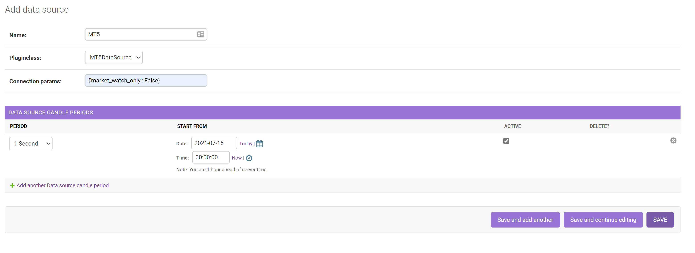
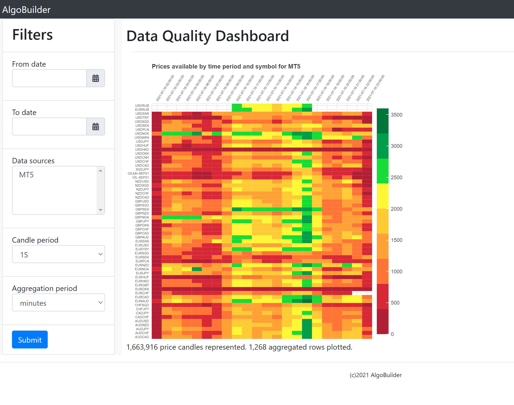

# Retrieving Price Data
To retrieve price data for AlgoBuilder, you will need to:
* Build your datasource; 
* Configure your datasource;
* Select the symbols to retrieve; and
* Define the periods for the price data candles to retrieve.

## Build your datasource
A datasource is the source of the symbol and price data for your application. AlgoBuilder can concurrently retrieve price data from  multiple datasources.

1) Create a python class to implement the connection to your price data source. This should extend ```pricedata.datasource.DataSourceImplementation```. Any parameters required for your data source will be provided during set up and can be accessed through ```self._data_source_model.get_connection_param('param_name')```. Your datasource must implement the following methods:
   * ```get_symbols(self) -> List[Dict[str, str]]:``` This should return a list of symbols for your datasource. Each symbol is a dict containing 'symbol_name' and 'instrument_type'. A list of supported instrument_types is available in ```models.instrument_types```.
   * ```get_prices(self, symbol: str, from_date: datetime, to_date: datetime, period: str) -> pd.DataFrame:``` This should return a dataframe of price data candles for the specified symbol name between the specified date range. The candles returned should be for the specified period. Supported period values are available in ```models.candle_periods```. For any period that you don't wish to support, you should raise a ```datasource.PeriodNotImplementedError```. 
   *  An example that retrieves symbol and price data from MetaTrader5 is provided below. This examples makes use of the MetaTrader copy_rates and copy_ticks APIs, using ticks and resampling for periods not supported by the rates API.

[MetaTrader5 Example](README/examples/mt5datasource.py)


2) Create a requirements.txt file containing all the modules required for your datasource. An example that supports the MetaTrader5 datasource is shown below.

requirements.txt
```text
MetaTrader5==5.0.34
pandas~=1.3.0
```

## Configure your datasource
1) Launch the applications web server if it isn't already running.
```shell
python manage.py runserver
```

3) Load the datasource as plugin, following the instructions for [loading a plugin](../plugin/README.md).
   
   
4) Navagate to the datasource admin page (http://localhost:8000/admin/pricedata/datasource/).

5) Click 'ADD DATASOURCE', then:
   * Provide a name for your datasource.
   * Select the DataSourceImplementation class that you loaded in step 3.
   * Provide any parameters required by your datasource class as a string representation of a dict. (e.g., the MetaTrader example above requires a market_watch_only parameter which can be input as {'market_watch_only': False}).
   * Add the candle periods that you would like to retrieve for your datasource. AlgoBuilder can be configured to retrieve price candle data for multiple periods at the same time. The 'start from' setting will be the first candle retrieved for the period when the candle data is retrieved from the datasource for the first time. Set the 'active' flag to enable retrieval of price data for period.
   * Click save.
   * Run the task repeater to push repeating requests to retrieve price data.
   ```shell
   celery -A algobuilder beat -l INFO
   ```
   * Run the task processor that you run to install your datasource plugin if it is not already running.
   ```shell
   celery -A algobuilder worker -l INFO --pool=solo
   ```
   
   
A screenshot for our above example has been provided below.
     

    
Your datasource will now be configured. All symbols from your datasource will be available in AlgoBuilder and AlgoBuilder will start retrieving price data for all symbols.

## Selecting symbols to retrieve
Once your datasources have been configured, all symbols for all datasources will be available in your application. A symbol exists only once across all data sources, i.e., multiple datasources can share the same symbol. You can edit your symbols to change their instrument type and set whether price data will be retrieved from a data source for that symbol.

Your data source implementation should have correctly populated the instrument type, however if not, this can be changed in the 'symbol' admin page. http://localhost:8000/admin/pricedata/symbol/

You can select whether price data will be retrieved for each symbol for each data source from the 'datasourcesymbol' admin page. http://localhost:8000/admin/pricedata/datasourcesymbol/ . Price data can be retrieved for each symbol from any number of data sources. Use the filters and search available symbols in the admin page to quickly find and select symbols by their name or instrument type. You can set and unset the retrieve price data flag for all selected symbols using the actions box at the top of the page.

## Checking data quality
Once the AlgoBuilder processor has been running for a few days, you should have built up a good set of price data to start building your features from. You can assess the quality of your price data using the AlgoBuilder price data quality chart. Navigate to http://localhost:8000/pricedata/quality/ and select the time periods, data sources, candle periods that you want to check for. You can use the aggregation period to aggregate your price data for testing across longer date ranges. This can take a while to run depending on the amount of data to be assessed. Once complete, you will be presented with a heatmap showing the number of candles retrieved for each symbol across each aggregated period. An example has been provided below.


